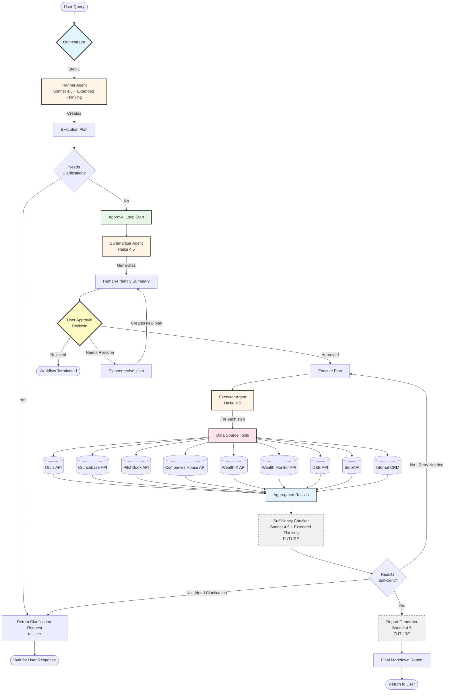
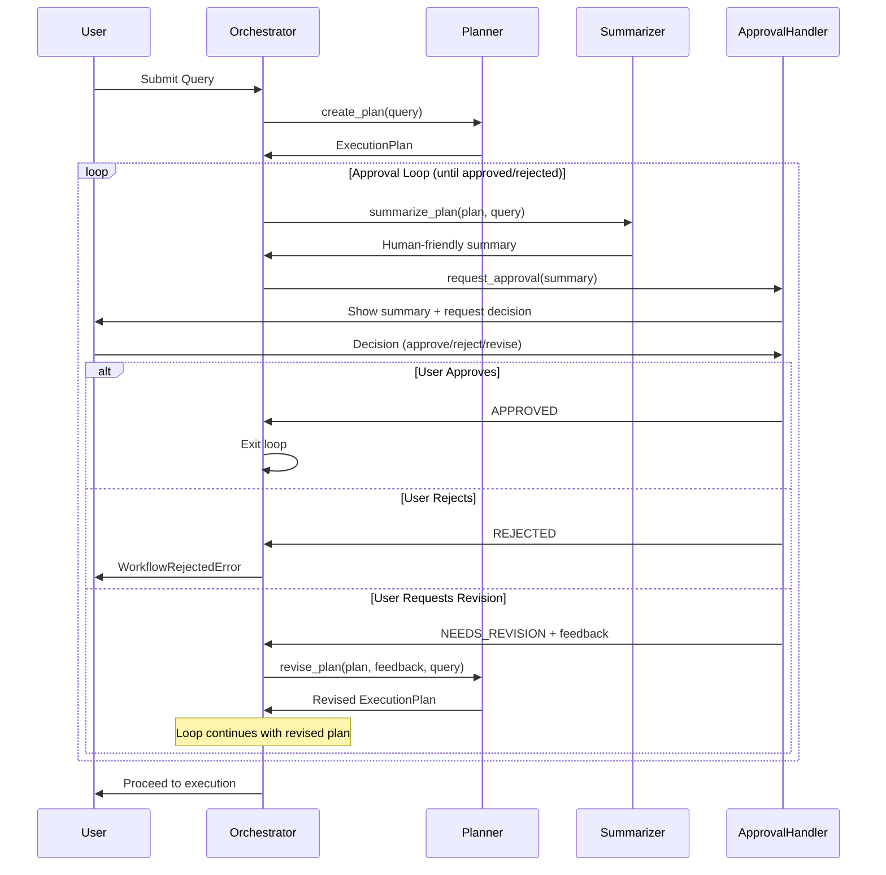
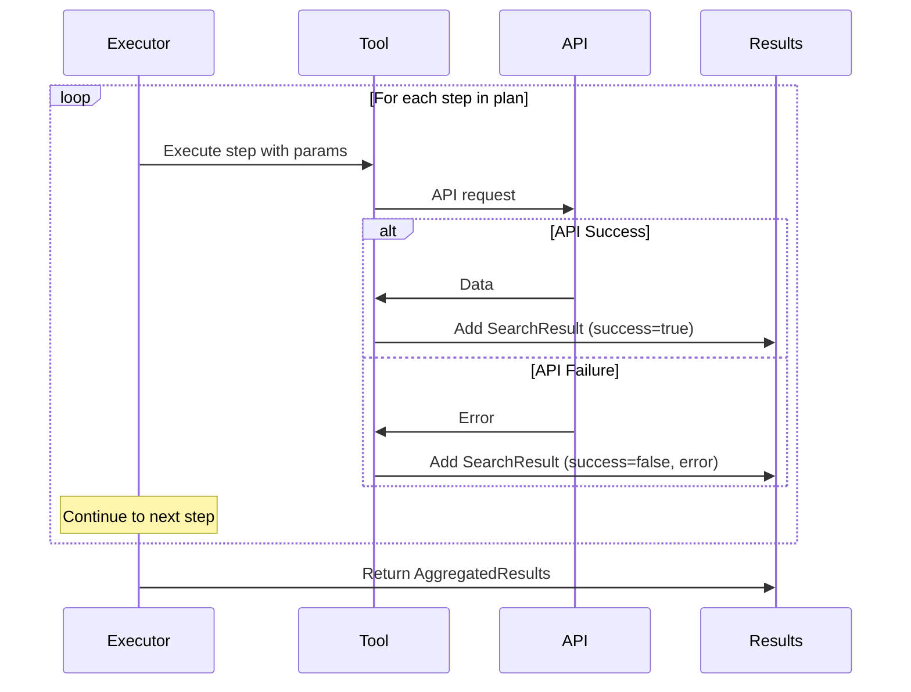

# Prospecting Agent Architecture Flow

## Complete System Flow Diagram



## Component Breakdown

### 1. Entry Point
- **User Query**: Natural language prospecting question
- **Orchestrator**: Main coordinator that manages the entire workflow

### 2. Planning Phase (Planner Agent)
- **Model**: Claude Sonnet 4.5 with Extended Thinking
- **Input**: User query
- **Output**: Structured ExecutionPlan with steps, data sources, parameters
- **Clarification**: If query is ambiguous, returns clarification questions

### 3. Approval Loop ⟲
This is a **critical iterative loop** that ensures user control:

1. **Summarizer Agent** converts technical plan to human-friendly summary
2. **User Decision** has 3 options:
   - ✅ **Approved** → Proceed to execution
   - ❌ **Rejected** → Terminate workflow
   - 🔄 **Needs Revision** → Loop back to Planner for revision

The loop continues until approval or rejection.

### 4. Execution Phase (Executor Agent)
- **Model**: Claude Haiku 4.5 (fast, cost-efficient)
- **Process**: Executes plan steps sequentially
- **Tools**: Calls various data source APIs based on plan
- **Output**: AggregatedResults with all data

### 5. Data Source Tools Layer
Nine different APIs that can be queried:
- **Orbis**: Corporate structures, financials, directors
- **Crunchbase**: Funding rounds, startups
- **PitchBook**: PE/VC deals, valuations
- **Companies House**: UK company filings, PSCs
- **Wealth-X**: UHNW profiles, wealth data
- **Wealth Monitor**: UK-specific wealth data
- **D&B**: Credit risk, firmographics
- **SerpAPI**: News and web search
- **Internal CRM**: Client exclusion check

### 6. Future Components (Not Yet Implemented)

#### Sufficiency Checker
- **Model**: Claude Sonnet 4.5 with Extended Thinking
- **Purpose**: Evaluate if results answer the original query
- **Outputs**:
  - ✅ **Sufficient** → Generate report
  - 🔄 **Retry Needed** → Re-execute with different parameters
  - ❓ **Clarification Needed** → Ask user for more details

#### Report Generator
- **Model**: Claude Sonnet 4.5
- **Purpose**: Create formatted markdown report
- **Output**: Professional prospect dossier

## Key Architectural Patterns

### 1. Human-in-the-Loop
The approval loop ensures users:
- Understand what data will be queried
- Can modify the approach before execution
- Maintain control over expensive API calls

### 2. Agent Specialization
Different models for different tasks:
- **Sonnet 4.5** (reasoning-heavy): Planning, sufficiency checking, reporting
- **Haiku 4.5** (fast execution): Summarizing, executing API calls

### 3. Iterative Refinement
Multiple feedback loops:
- **Planning Loop**: Clarification if query unclear
- **Approval Loop**: User can request plan revisions
- **Execution Loop**: (Future) Retry if results insufficient

### 4. Separation of Concerns
Each agent has a single responsibility:
- Planner → Strategy
- Summarizer → Communication
- Executor → Execution
- Sufficiency → Quality control
- Reporter → Presentation

## Data Flow Example

**Query**: "Find UK tech companies that raised Series B in last 12 months"

```
1. User Query
   ↓
2. Planner Agent
   → Creates plan: [Crunchbase search] → [PitchBook cross-ref] → [Companies House directors] → [CRM check]
   ↓
3. Approval Loop
   → Summarizer: "I'll search Crunchbase for Series B rounds in UK (last 12mo), verify with PitchBook..."
   → User: "Approved ✅"
   ↓
4. Executor Agent
   → Step 1: Crunchbase API (found 23 companies)
   → Step 2: PitchBook API (cross-referenced, found 18 matches)
   → Step 3: Companies House (got directors for 18 companies)
   → Step 4: CRM (excluded 2 existing clients)
   ↓
5. Sufficiency Checker (Future)
   → Evaluates: 16 unique prospects with funding + director data
   → Decision: SUFFICIENT ✅
   ↓
6. Report Generator (Future)
   → Creates markdown report with prospect profiles
   ↓
7. Return to User
```

## Current Implementation Status

| Component | Status | Model |
|-----------|--------|-------|
| Orchestrator | ✅ Implemented | N/A |
| Planner Agent | ✅ Implemented | Sonnet 4.5 + Extended Thinking |
| Summarizer Agent | ✅ Implemented | Haiku 4.5 |
| Executor Agent | ✅ Implemented | Haiku 4.5 |
| Data Source Tools | ✅ Implemented (mocked) | N/A |
| Approval Handler | ✅ Implemented | N/A |
| Sufficiency Checker | ⏳ TODO | Sonnet 4.5 + Extended Thinking |
| Report Generator | ⏳ TODO | Sonnet 4.5 |

## Loop Details

### Approval Loop Detailed Flow



### Execution Loop (Per-Step)



## Configuration Points

Key settings in [config.py](src/config.py):

```python
# Model selection
planner_model: str = "eu.anthropic.claude-sonnet-4-5-20250514-v1:0"
executor_model: str = "eu.anthropic.claude-haiku-4-5-20250514-v1:0"

# Extended thinking (for Planner)
enable_extended_thinking: bool = True
thinking_budget_tokens: int = 10000

# Execution
mock_apis: bool = True  # Use mocks vs real APIs
api_timeout_seconds: int = 30
max_retries: int = 2
```
